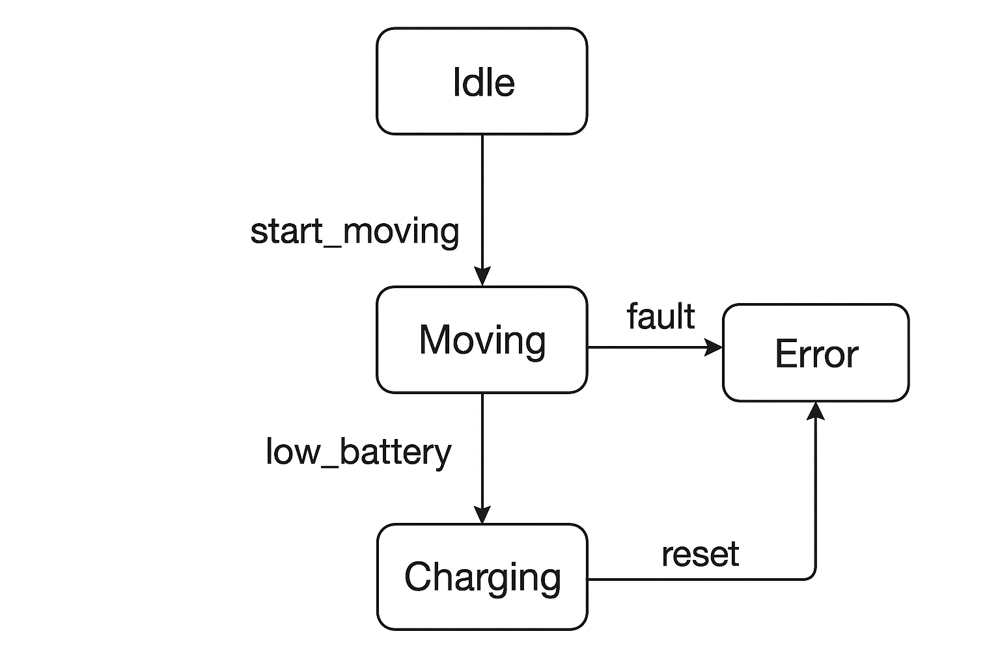

# 🤖 Robot State Machine Project

This is a simple Python project that shows how a robot can use a **finite state machine (FSM)** to manage its states like `idle`, `moving`, `charging`, and `error`.  
The project includes test scripts using `pytest` to make sure all transitions work correctly, and there’s a diagram showing how the states connect.  
It’s meant as a learning project for anyone interested in **robotics** or **IoT**.

---

## 📂 Project Structure

state_machine_project/
│── README.md
│── fsm.png # FSM diagram
│── requirements.txt
│── src/
│ ├── init.py
│ └── robot_fsm.py # State machine code
│── tests/
├── init.py
└── test_robot_fsm.py # Test scripts


---

## ⚡ Features

- Robot states: `idle`, `moving`, `charging`, `error`  
- Transition triggers: `start_moving()`, `stop()`, `low_battery()`, `charged()`, `fault()`, `reset()`  
- Unit tests included to verify all transitions using `pytest`  
- FSM diagram showing all states and transitions  

---

## 🛠️ Installation

1. Clone the repository:

```bash
git clone https://github.com/YOUR-USERNAME/robot-state-machine.git
cd robot-state-machine


2. Install dependencies:

pip install -r requirements.txt

📈 Running Tests

We will be Running all test scripts with:

pytest -v

## 🤖 Robot FSM Diagram

This diagram shows all states of the robot and how it transitions between them:




Output will be like this:

tests/test_robot_fsm.py::test_initial_state PASSED
tests/test_robot_fsm.py::test_moving_cycle PASSED
tests/test_robot_fsm.py::test_low_battery_to_charging PASSED
tests/test_robot_fsm.py::test_charged_back_to_idle PASSED
tests/test_robot_fsm.py::test_fault_and_reset PASSED
